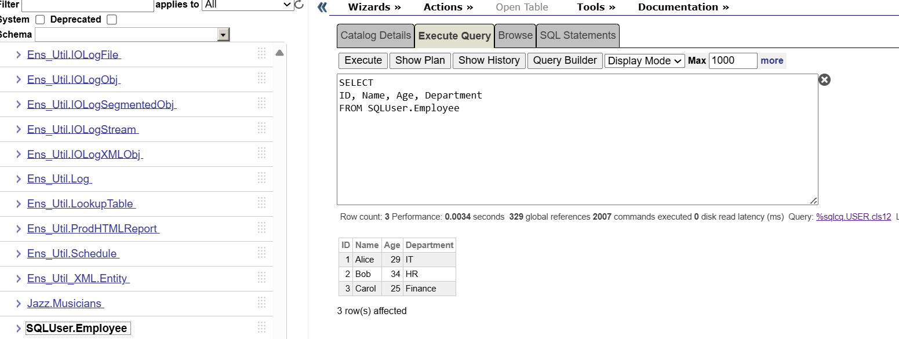
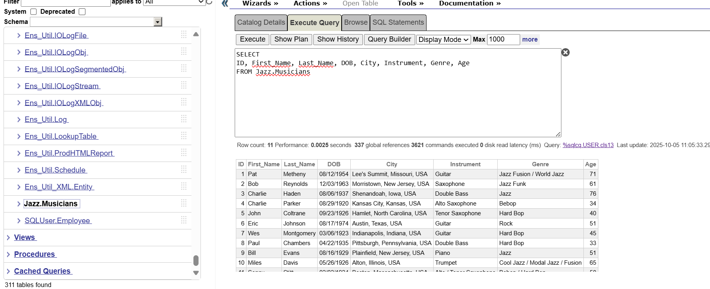
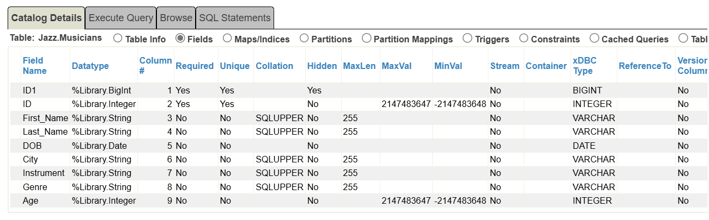
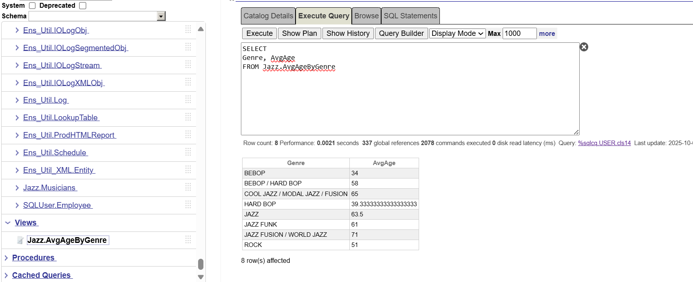

# IRIS Tool and Data Manager

A comprehensive Python toolkit for integrating pandas DataFrames with InterSystems IRIS databases, featuring a Streamlit-based data management interface.

## Overview

This proof of concept (POC) demonstrates how InterSystems IRIS can be integrated with pandas and plotly Python libraries via the Python SDK (IRIS Native).

It consists of two main components:

1. **IRIStool**: A Python module which takes advantage of pandas to perform IRIS database operations
2. **IRIS Data Manager**: A Streamlit web application for visual data management and analysis

<details>
<summary><b>Installation</b></summary>

## Installation

### Prerequisites

- Python 3.8+
- Docker and Docker Compose
- Git

### Setup Steps

1. **Clone the repository**

```bash
git clone https://github.com/pietrodileo/iris_tool_and_data_manager.git
cd iris_tool_and_data_manager
```

2. **Create and activate virtual environment**

I like to us `uv` package manager, but you can use whatever:

```bash
uv venv
.\.venv\Scripts\activate
```

3. **Install dependencies**

```bash
uv pip install -r requirements.txt
```

4. **Set up environment variables**
Edit `.env` file with your configuration:

```bash
IRIS_HOST=your_iris_host
IRIS_PORT=your_iris_port  
IRIS_NAMESPACE=your_namespace
IRIS_USER=your_username
IRIS_PASSWORD=your_password
OLLAMA_API_URL=your_ollama_api_url
```

Feel free to use the default configuration:

```bash
IRIS_HOST=127.0.0.1
IRIS_PORT=9091
IRIS_NAMESPACE=USER
IRIS_USER=_SYSTEM
IRIS_PASSWORD=SYS
OLLAMA_API_URL=http://localhost:11424/api/chat
```

5. **Start InterSystems IRIS with Docker**

Open Docker Desktop and run the following instruction:

```bash
docker-compose up -d --build
```

This will pull two images:

* ollama/ollama:latest
* intersystems/iris-community:latest-cd

Ollama image will install three models by default:

* gemma2:2b
* gemma3:4b
* gemma3:1b 

You can choose which models to pull by the `ollama_entrypoint.sh` file.

6. **Run the application or quickstart.py**

`quickstart.py` provides an example of how **IRISTool** module can be used to create tables and views from pandas dataframe. Run it by the instruction:

```bash
uv run quickstart.py
```

The Management Portal of the containerized instace can be accessed at `http://localhost:9092/csp/sys/UtilHome.csp`

**IRIS Data Manager UI** provides a complete interface to import, visualize and manage data and can be run via the instruction:

```bash
uv run streamlit run app.py
```

The application will open in your browser at `http://localhost:8501`

## IRIStool Module

The `IRIStool` class provides a pandas-friendly interface to InterSystems IRIS databases with support for:

- DataFrame to table conversion with automatic type inference
- CRUD operations (Create, Read, Update, Delete)
- Index management (standard, HNSW vector indexes)
- View creation and management
- Schema exploration

</details>

<details>
<summary><b>Quick Start Example</b></summary>

### Quick Start Example

This quickstart example demonstrates how to use the IRIStool Python utility to interact with an InterSystems IRIS database using a familiar and Pythonic interface.
It shows how to:

* Establish a connection using environment variables
* Create tables and insert data
* Execute SQL queries and retrieve data as Pandas DataFrames
* Automatically infer IRIS data types from a DataFrame
* Convert a DataFrame to an IRIS table
* Update, query, and create SQL views dynamically

### Key Features

**Automatic Type Inference**: The module intelligently maps pandas dtypes to IRIS SQL types, making table creation seamless and reducing manual schema work:

- Integer types → INT/BIGINT
- Float types → DOUBLE
- Datetime → DATE/TIME/DATETIME
- Strings → VARCHAR/CLOB (based on length)
- Boolean → BIT

**Creating Tables**:
Easily create or update IRIS tables using Python dictionaries that define column names, data types, and constraints:

```python
iris.create_table(
    "Employee",
    columns={
        "ID": "INT",
        "Name": "VARCHAR(100)",
        "Age": "INT",
        "Department": "VARCHAR(50)"
    },
    constraints=["PRIMARY KEY (ID)"],
    check_exists=True
)
```

**Convert To and From DataFrames**:

Seamlessly move data between IRIS and pandas

```python
# Convert a pandas DataFrame into an IRIS table
iris.df_to_table(
    df=musicians,
    table_name="Musicians",
    table_schema="Jazz",
    primary_key="ID",
    drop_if_exists=True
)

# Fetch SQL query results directly into a pandas DataFrame
df = iris.fetch("SELECT * FROM Jazz.Musicians WHERE Genre = ?", ["Hard Bop"])
print(df.head())
```

Type mapping, primary keys, and indices can all be automatically inferred from the DataFrame.

**Creating Indices (with Vector Search Support)**: 

Define and manage multiple types of indices, including traditional B-Tree and HNSW (Hierarchical Navigable Small World) for vector similarity search:

```python
# Standard index
iris.create_index(
    table_name="Musicians",
    column_name="Genre",
    index_type="index"
)

# Vector search index
iris.create_hnsw_index(
    table_name="Documents",
    column_name="Embedding",
    index_name="doc_vector_idx",
    distance="Cosine",
    M=16,
    ef_construct=200
)
```

**Context Manager Support**: Automatic connection cleanup:

All operations can be run safely inside a Python with block — ensuring automatic connection cleanup:

```python
with IRIStool(host, port, namespace, username, password) as iris:
    iris.create_table(...)
    iris.insert_many(...)
# Connection automatically closed on exit
```

### Run the example

```bash
uv run quickstart.py
```

Expected output is:

``` bash
IRIS connection [_SYSTEM@127.0.0.1:9091/USER]
Employee table found! Dropping table...
table SQLUser.Employee dropped successfully.
Table SQLUser.Employee created successfully.
Inserting data...
3 row(s) added into SQLUser.Employee.
Retrieving data of employees with age greater than 28...
   ID   Name  Age Department
0   1  Alice   29         IT
1   2    Bob   34         HR
Describing dataframe:
             ID        Age
count  2.000000   2.000000
mean   1.500000  31.500000
std    0.707107   3.535534
min    1.000000  29.000000
25%    1.250000  30.250000
50%    1.500000  31.500000
75%    1.750000  32.750000
max    2.000000  34.000000
Retrieving table information...
Columns:
[{'TABLE_SCHEMA': 'SQLUser', 'TABLE_NAME': 'Employee', 'COLUMN_NAME': 'ID', 'DATA_TYPE': 'integer', 'CHARACTER_MAXIMUM_LENGTH': None, 'IS_NULLABLE': 'NO', 'AUTO_INCREMENT': 'NO', 'UNIQUE_COLUMN': 'YES', 'PRIMARY_KEY': 'YES', 'odbctype': 4}, {'TABLE_SCHEMA': 'SQLUser', 'TABLE_NAME': 'Employee', 'COLUMN_NAME': 'Name', 'DATA_TYPE': 'varchar', 'CHARACTER_MAXIMUM_LENGTH': 100, 'IS_NULLABLE': 'YES', 'AUTO_INCREMENT': 'NO', 'UNIQUE_COLUMN': 'NO', 'PRIMARY_KEY': 'NO', 'odbctype': 12}, {'TABLE_SCHEMA': 'SQLUser', 'TABLE_NAME': 'Employee', 'COLUMN_NAME': 'Age', 'DATA_TYPE': 'integer', 'CHARACTER_MAXIMUM_LENGTH': None, 'IS_NULLABLE': 'YES', 'AUTO_INCREMENT': 'NO', 'UNIQUE_COLUMN': 'NO', 'PRIMARY_KEY': 'NO', 'odbctype': 4}, {'TABLE_SCHEMA': 'SQLUser', 'TABLE_NAME': 'Employee', 'COLUMN_NAME': 'Department', 'DATA_TYPE': 'varchar', 'CHARACTER_MAXIMUM_LENGTH': 50, 'IS_NULLABLE': 'YES', 'AUTO_INCREMENT': 'NO', 'UNIQUE_COLUMN': 'NO', 'PRIMARY_KEY': 'NO', 'odbctype': 12}]
Indices:
[{'INDEX_NAME': 'EMPLOYEEPKey1', 'COLUMN_NAME': 'ID', 'PRIMARY_KEY': 1, 'NON_UNIQUE': 0}]
Musicians dataframe:
   ID First Name   Last Name        DOB                           City       Instrument      Genre  Age
0   1        Pat     Metheny 1954-08-12    Lee's Summit, Missouri, USA           Guitar  Jazz Rock   71
1   2        Bob    Reynolds 1963-12-03    Morristown, New Jersey, USA        Saxophone  Jazz Funk   61
2   3    Charlie       Haden 1937-08-06          Shenandoah, Iowa, USA      Double Bass       Jazz   76
3   4    Charlie      Parker 1920-08-29       Kansas City, Kansas, USA   Alto Saxophone      Bebop   34
4   5       John    Coltrane 1926-09-23    Hamlet, North Carolina, USA  Tenor Saxophone   Hard Bop   40
5   6       Eric     Johnson 1974-08-17             Austin, Texas, USA           Guitar       Rock   51
6   7        Wes  Montgomery 1923-03-06     Indianapolis, Indiana, USA           Guitar   Hard Bop   45
7   8       Paul    Chambers 1935-04-22  Pittsburgh, Pennsylvania, USA      Double Bass   Hard Bop   33
8   9       Bill       Evans 1929-08-16    Plainfield, New Jersey, USA            Piano       Jazz   51
Inferring types...
{'ID': 'INT', 'First_Name': 'VARCHAR(255)', 'Last_Name': 'VARCHAR(255)', 'DOB': 'DATE', 'City': 'VARCHAR(255)', 'Instrument': 'VARCHAR(255)', 'Genre': 'VARCHAR(255)', 'Age': 'INT'}
Converting DataFrame to IRIS table...
Table Jazz.Musicians already exists.
table Jazz.Musicians dropped successfully.
Table Jazz.Musicians created successfully.
Index Musicians_Last_Name_index created successfully on Jazz.Musicians(Last_Name).
Index Musicians_Genre_index created successfully on Jazz.Musicians(Genre).
Index Musicians_Instrument_index created successfully on Jazz.Musicians(Instrument).
Inserted 9 rows into Musicians
Bop artists:
  First_Name   Last_Name       Instrument     Genre
0    Charlie      Parker   Alto Saxophone     Bebop
1       John    Coltrane  Tenor Saxophone  Hard Bop
2        Wes  Montgomery           Guitar  Hard Bop
3       Paul    Chambers      Double Bass  Hard Bop
Inserting new musicians...
2 row(s) added into Jazz.Musicians.
Updating a record...
Updated 1 row(s) in Jazz.Musicians.
View Jazz.AvgAgeByGenre created.
2 row(s) added into Jazz.Musicians.
Updating a record...
Updated 1 row(s) in Jazz.Musicians.
2 row(s) added into Jazz.Musicians.
Updating a record...
Updated 1 row(s) in Jazz.Musicians.
Updating a record...
Updated 1 row(s) in Jazz.Musicians.
Updated 1 row(s) in Jazz.Musicians.
View Jazz.AvgAgeByGenre created.
                             Genre                AvgAge
View Jazz.AvgAgeByGenre created.
                             Genre                AvgAge
0                            BEBOP                    34
0                            BEBOP                    34
1                 BEBOP / HARD BOP                    58
1                 BEBOP / HARD BOP                    58
2  COOL JAZZ / MODAL JAZZ / FUSION                    65
3                         HARD BOP  39.33333333333333333
4                             JAZZ  63.50000000000000000
5                        JAZZ FUNK                    61
6         JAZZ FUSION / WORLD JAZZ                    71
7                             ROCK                    51
```

Created tables and view are available in the Management Portal SQL as well:





</details>

<details>
<summary><b>IRIS Data Manager UI</b></summary>

## IRIS Data Manager UI

The Streamlit-based interface provides a visual way to interact with your IRIS database without writing code.

Run the UI with the instruction:

```python
uv run streamlit run .\app.py
```

### Features

#### 1. Connection Management (Sidebar)

- Configure connection parameters (host, port, namespace, credentials)
- Test connection with real-time feedback
- Default values loaded from `.env` file
  
[iris_data_manager_connect.webm](https://github.com/user-attachments/assets/74a75134-64c8-4ed1-b53f-72f14fbd2e6f)

#### 2. Upload Data Tab

Upload and import data from various formats:

- **Supported formats**: CSV, Excel (XLSX/XLS), JSON
- **Pre-import preview**: View data before saving
- **View data before importing them**
- **Schema configuration**:
  - Specify table name and schema
  - Define primary key
  - Create indexes (standard, unique, HNSW for vectors)

You can try the app using the examples provided in the `./examples` folder.

[iris_data_manager_import_data.webm](https://github.com/user-attachments/assets/34414378-2812-4585-aa4f-f1df8d86d332)

#### 3. Explore & Analyze Tab

Comprehensive data exploration and analysis:

**a) Table Selection and Data Viewing**

- Browse available schemas
- Select tables from dropdown
- Download table as XLSX, CSV or JSON

[iris_data_manager_visualize.webm](https://github.com/user-attachments/assets/098c7ee4-42d0-47d9-ad67-fe0fe92861a1)

**b) Data Profile**

- Show table information and download statistics
- Show statistics and distribution for numerical and categorical columns

[iris_data_manager_data_profile.webm](https://github.com/user-attachments/assets/3544859e-524f-448f-bda1-a7ef5013736f)

**c) Filtering & Visualization**

- Apply filters on multiple columns (text, numeric, date)
- Export filtered results as CSV
- Create visualizations:
  - Bar charts for categorical data
  - Line charts for time series
  - Scatter plots for correlations
  - Histograms for distributions

**d) Aggregations**

- Group by single or multiple columns
- Apply aggregate functions (COUNT, SUM, AVG, MIN, MAX)
- Visualize aggregated results

**e) Text-to-SQL**

- Natural language query interface
- AI-powered SQL generation
- Execute generated queries
- View and download results

### Usage Workflow

1. **Connect**: Configure and test database connection in sidebar
2. **Upload**: Import data files or create tables manually
3. **Explore**: Browse existing tables and examine structure
4. **Analyze**: Apply filters, create visualizations, run aggregations
5. **Query**: Use natural language or SQL to extract insights

## Use Cases

- **Data Migration**: Easily move data between pandas and IRIS
- **Prototyping**: Quickly test data models before production
- **Analytics**: Combine pandas processing with IRIS storage
- **Vector Search**: Build semantic search applications with HNSW indexes
- **Data Exploration**: Visual interface for non-technical users
- **ETL Workflows**: Transform and load data into IRIS

</details>
